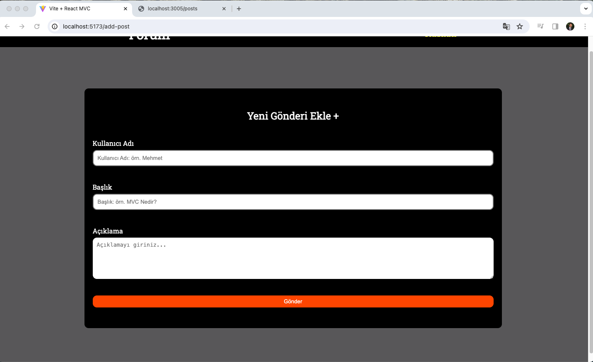
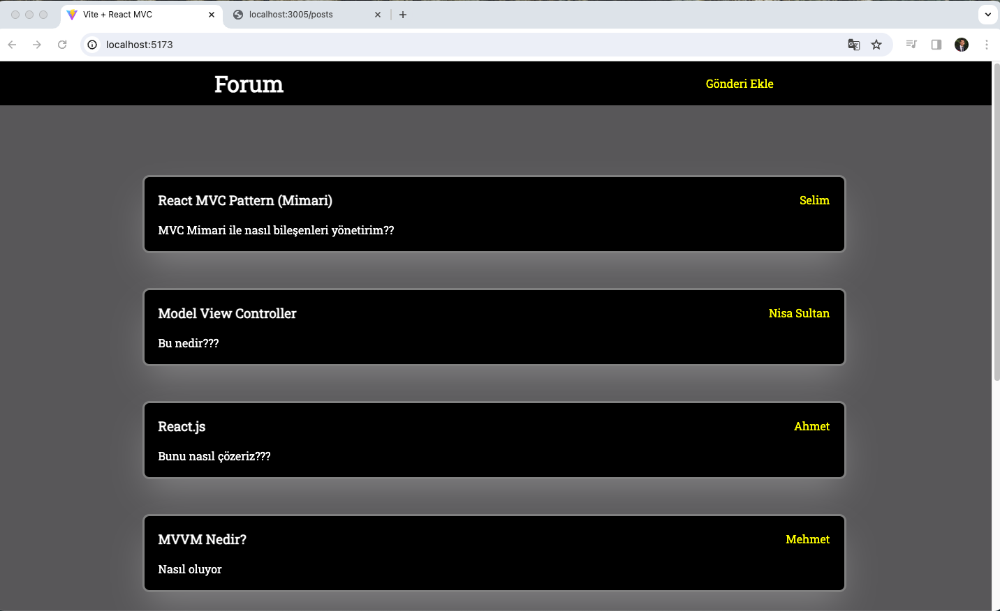
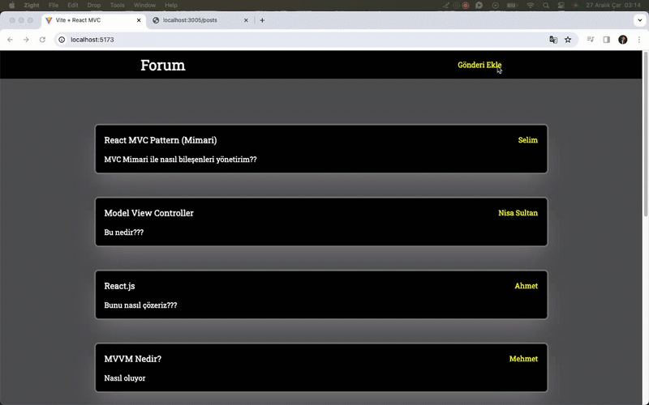

# React + Vite

MVC mimarisi kullanarak bir forum projesi oluşturdum.

# Kütüphanelerim
- react-router-dom
- json-server
- axios
- sass
- uuid

# Ekran Görüntüleri

# Video

https://github.com/EyupSaltukB/MVC-Forum/assets/129687853/37bdf553-b754-4637-955c-aa90f60eb436

# GIF

# MVC -> Model View Controller
- MVC Yapısı Nedir ?

* Model: 
- Veri yapısını kontrol eder.

* View: 
- Kullanıcı arayüzünü temsil eder.
- JSX kodları bu dosyada yazılır.

* Controller: 
- Model ve View arasındaki iletişimi kurar.
- Kullanıcı etkileşimde kullanılacak 
fonksiyonlar ve API istekleri burada yazılır.

# Yol Haritası
- API üzerinden blog verileri al - (Controller ile)

- Her blog elemanı için kart oluştur - (View ile)

- Bir Form Arayüzü oluştur (View)

- Formdaki inputlar her değiştiğinde stateleriini tut (Controller)

- State üstünde tutulacakk değerleri belirle (Model)

- Gönder Butonuna basıldığında postu apiye gönder ve kullnaıcıyı yöndeldir (Controller)
